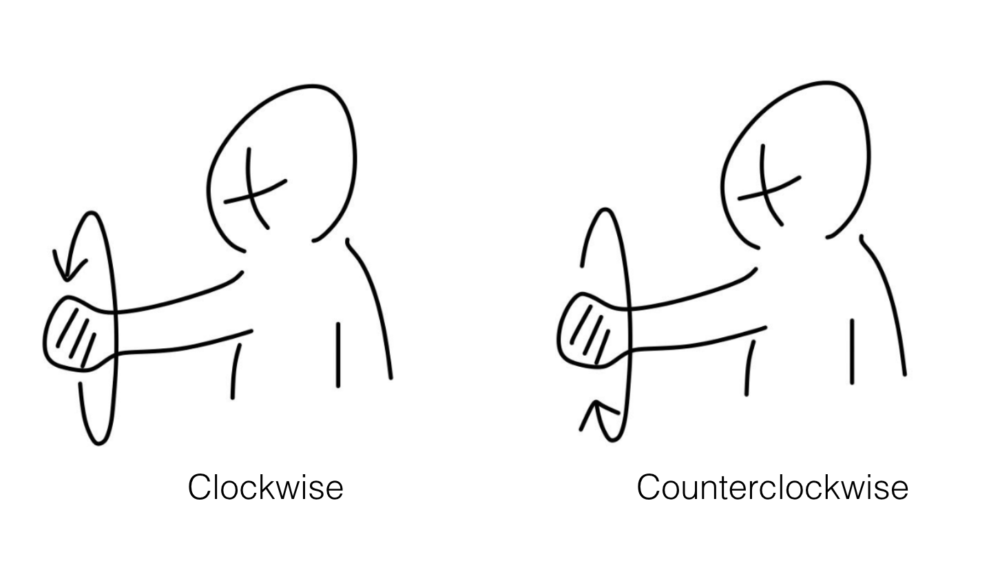
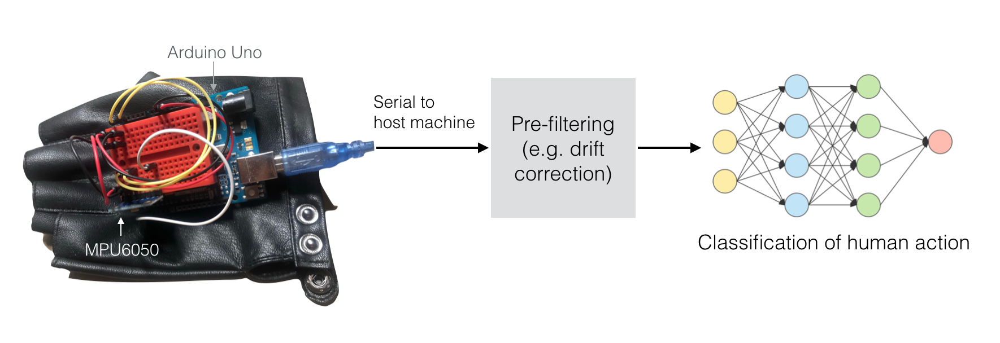

# Wheel-recognizing glove

## Overview

Here, we build a simple human action input device based on 3-axis accelerometer (MPU6050) gesture recognition on a glove form factor to intelligently interface with machines without explicit touch and just in-air.

We draw inspiration from one of the greatest interface technology of our generation - the iPod wheel used for volume control, menu scrolling, etc. 

Our glove gives an extra spin to the wheel gestures by recognizing it over the air - thus opening up more convenient user scenarios (e.g. remote volume control of your smart speaker from couch).

The MPU6050 sensor talks to an Ardunio Uno which sends 3-axis accelerometer values periodically to a host machine. The host runs a simple 1-layer neural network to recognize a left or right wheel intent and gives a user feedback. The data flow is summarized below as a diagram.

A sample live demo of the working system is shown below.

## Project timeline

~~Phase 1: complete serial gestures demo~~
Phase 2: complete battery-powered, local-comm demo tied to proper MacBook UX (e.g. monitor brightness)