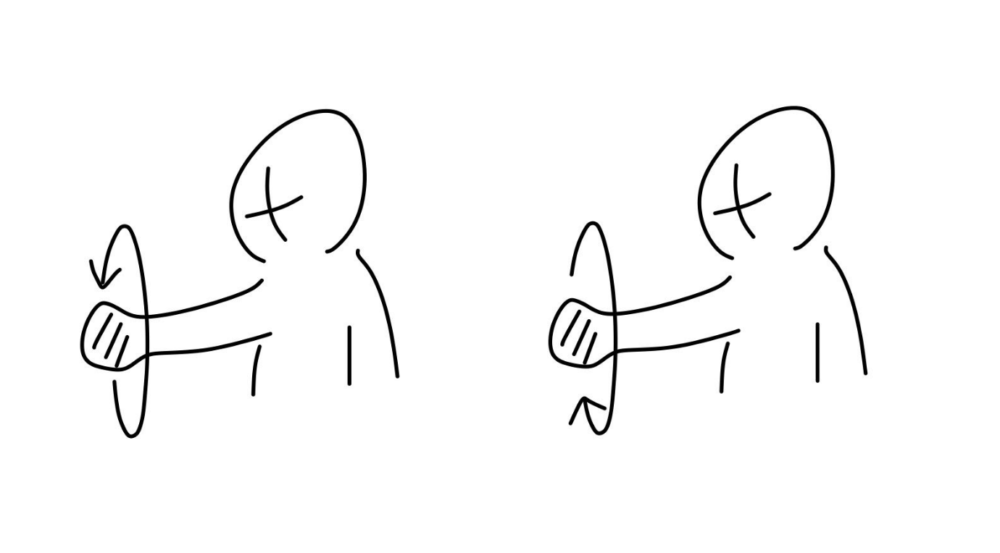
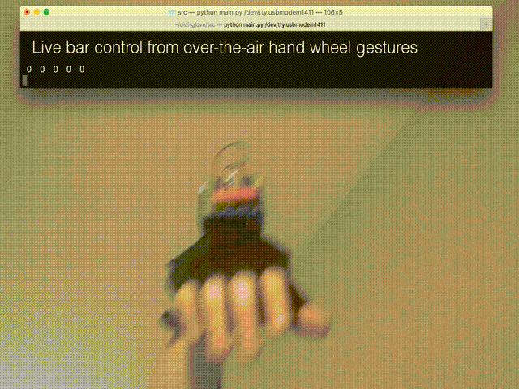

# Gesture Box Project

Build a simple human input device based on 3-axis accelerometer (MPU6050) gesture recognition to interface with machines.

## Prototype

- Simple Arduino + MPU6050 HW for algo prototyping
- Keras based model for circle, linear action classification
- A live debug plotter for 3-axis accel with classification result

A sample live demo is shown below.

